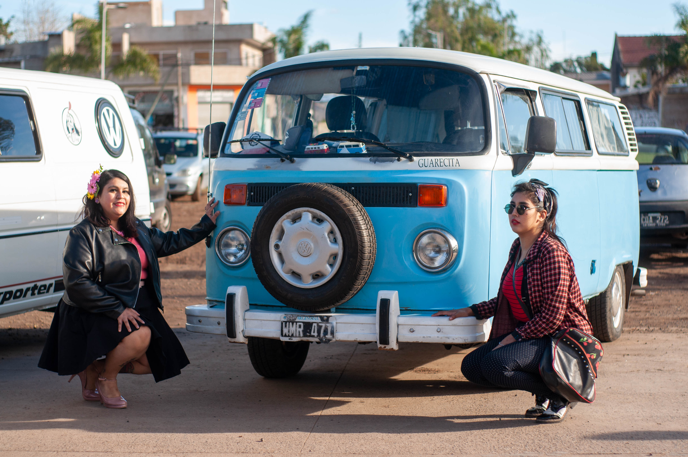
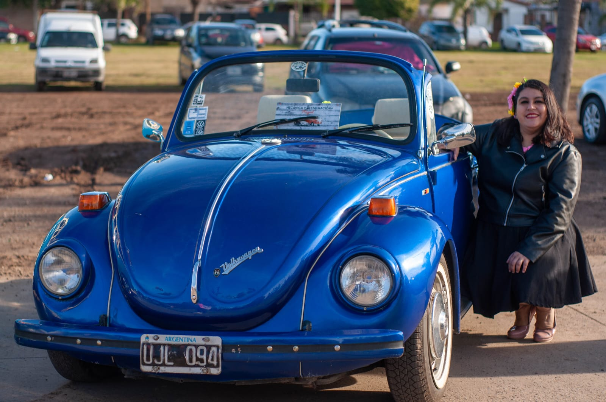

<!DOCTYPE html>
<html lang="en">

<head>
    <meta charset="UTF-8" />
    <meta name="viewport" content="width=device-width, initial-scale=1.0" />
    <title>Proyecto web</title>
    <link rel="stylesheet" href="modo-oscuro.css" />
    <link rel="stylesheet" href="style.css" />
</head>

<body id="cuerpo">
    <header>
        <nav>
            <ul>
                <li><a href="#banner">Inicio</a></li>
                <li><a href="#productos">Productos</a></li>
                <li><a href="#contacto">Contacto</a></li>
            </ul>
        </nav>
    </header>
    <main>
        <section id="banner">
            <h1>Bienvenidos a Pinup Inclusive</h1>
            <h2>Todos sean bienvenidos</h2>
        </section>
        <section id="productos">
            <h2>Sesiónes temáticas</h2>
            

                

                    
                    <h3>Sesión temática otoño</h3>
                    
$10.000

                    <a href="https://api.whatsapp.com/send?phone=5491122872644&text=Hola en instantes respondemos su mensaje, muchas gracias por comunicarte con Pinup Inclusive">Comprar</a
            >
          

          

            
            <h3>Sesión temática otoño</h3>
            
$10.000

            <a href="https://api.whatsapp.com/send?phone=5491122872644&text=Hola e unos instantes respondemos su mensaje, muchas gracias por comunicarse con Pinup Inclusive"
              >Comprar</a
            >
          

          

            
            <h3>Sesion con autos clásicos</h3>
            
$10.000

            <a href="https://api.whatsapp.com/send?phone=5491122872644&text=Hola en unos instantes respondemos su mensaje, muchas gracuas por comunicarse con Pinup Inclusive"
              >Comprar</a
            >
          

          

            
            <h3>Sesión con autos clasicos</h3>
            
$10.000

            <a href="https://api.whatsapp.com/send?phone=35491122872644&text=Hola en unos instantes respondemos su mensaje, muchas gracias por comunicarse con Pinup Inclusive"
              >Comprar</a
            >
          

          

            
            <h3>Sesión de fotos de Pascuas</h3>
            
$10.000

            <a href="https://api.whatsapp.com/send?phone=35491122872644&text=Hola en unos instantes respondemos su mensaje, muchas gracias por comunicarse con Pinup Inclusive"
              >Comprar</a
            >
          

          

            
            <h3>Sesión de fotos de cumpleaños</h3>
            
$10.000

            <a href="https://api.whatsapp.com/send?phone=5491122872644&text=Hola en unos instantes respondemos su mensaje, muchas gracias por comunicarse con Pinup Inclusive"
              >Comprar</a
            >
          

        

      </section>
      <section id="contacto">
        <h2>Contacto</h2>
        <form action="https://formsubmit.co/andreatamaraesbarra@gmail.com" method="POST">
          <label for="name">Nombre:</label>
          <input type="text" name="name" required />

          <label for="email">Email:</label>
          <input type="email" name="email" required />

          <label for="message">Mensaje:</label>
          <textarea name="message" rows="4" required></textarea>

          <button>Enviar</button>
        </form>
      </section>
    </main>
    <footer>
      
2024 Proyecto web - Incluyeme

    </footer>

    <button id="boton-cambiar-modo">Cambiar modo</button>

    
  </body>
</html>
* {
    margin: 0;
    padding: 0;
    font-family: "Gill Sans", "Gill Sans MT", Calibri, "Trebuchet MS";
}

body {
    transition: 1s all;
}

header {
    background-color: gray;
    color: white;
    padding: 10px 0;
    text-align: center;
}

header ul {
    list-style: none;
    display: flex;
    justify-content: center;
    gap: 10px;
}

header ul a {
    color: white;
}

main {
    padding: 20px;
}

#banner {
    text-align: center;
    background-color: steelblue;
    height: 50vh;
    display: flex;
    flex-direction: column;
    justify-content: center;
}

#productos {
    padding: 20px;
}

#productos img {
    width: 150px;
    display: block;
    margin: auto;
    padding-bottom: 10px;
}

#productos h2 {
    text-align: center;
    padding-bottom: 20px;
}

#productos .grid {
    display: flex;
    flex-wrap: wrap;
    gap: 20px;
    justify-content: center;
}

.producto {
    background-color: #e2e2e2;
    border: 1px solid #ccc;
    padding: 20px;
}

.producto a {
    padding: 8px 20px;
    background-color: lightblue;
    text-decoration: none;
    border-radius: 5px;
    display: inline-block;
    color: black;
    text-align: center;
    margin-top: 10px;
}

#contacto {
    background-color: #f4f4f4;
    text-align: center;
    padding: 20px 0;
}

#contacto h2 {
    padding-bottom: 20px;
}

form {
    display: flex;
    flex-direction: column;
    max-width: 400px;
    margin: auto;
}

form label {
    margin-bottom: 5px;
}

form input,
form textarea {
    margin-bottom: 10px;
    padding: 5px;
    border: 1px solid #ccc;
    border-radius: 5px;
    max-width: 100%;
}

form button {
    padding: 10px 20px;
    background-color: lightblue;
    color: black;
    border: none;
    border-radius: 5px;
    cursor: pointer;
    width: 100%;
}

footer {
    background-color: #333;
    color: white;
    text-align: center;
    padding: 20px;
}

#boton-cambiar-modo {
    position: fixed;
    bottom: 20px;
    right: 20px;
    padding: 10px 20px;
    background-color: #333;
    color: white;
    border: none;
    cursor: pointer;
    border-radius: 10px;
}

body.modo-oscuro {
    background-color: #121212;
    color: white;
}

body.modo-oscuro header {
    background-color: darkred;
}

body.modo-oscuro #banner {
    background-color: darkgrey;
}

body.modo-oscuro .producto {
    background-color: #333;
}

body.modo-oscuro #contacto {
    background-color: #222;
}

body.modo-oscuro #boton-cambiar-modo {
    background-color: white;
    color: black;
}
let boton = document.getElementById("boton-cambiar-modo");

boton.addEventListener("click", () => {
    document.body.classList.toggle("modo-oscuro");
})
